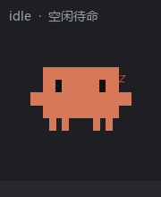

# Claude Code Desktop Pet 🧡

English | [简体中文](README.md)

A tiny block-pixel pet that mirrors the live status of **Claude Code**. The character is
Claude Code's orange "spark" mascot, and **no matter how many Claude Code windows you open,
there is only ever one pet on the desktop** — its mood is the aggregate of all your sessions.

<p align="center">
  
</p>

> Windows · Python 3.9+ · pure-tkinter vector pixels, **no image assets, no third-party deps**.
> (The demo GIF above is rendered offline from the pet's own pixel sprites via `python make_demo_gif.py`.)

## Quick start

```powershell
# 1) Clone
git clone https://github.com/vito111111/claude-pet.git
cd claude-pet

# 2) Preview without Claude Code (a few seconds of looping animation)
python pet.py --selftest

# 3) Wire it into Claude Code: merge the hooks below into ~/.claude/settings.json
#    (replace <DIR> with this repo's absolute path)
```

```jsonc
// ~/.claude/settings.json  →  "hooks"  (merge with your existing hooks, don't overwrite)
{
  "hooks": {
    "SessionStart":     [{ "hooks": [{ "type": "command", "command": "powershell -NoProfile -File \"<DIR>\\ensure_pet.ps1\"" }] }],
    "UserPromptSubmit": [{ "hooks": [{ "type": "command", "command": "python \"<DIR>\\hook_status.py\" working" }] }],
    "Stop":             [{ "hooks": [{ "type": "command", "command": "python \"<DIR>\\hook_status.py\" done" }] }],
    "SessionEnd":       [{ "hooks": [{ "type": "command", "command": "python \"<DIR>\\hook_status.py\" end" }] }]
  }
}
```

Hooks only take effect in a **new** Claude Code session. `ensure_pet.ps1` and `hook_status.py`
are portable (they auto-locate their own directory and `pythonw.exe`), so no code changes are
needed across machines.

## Three states

| State | Trigger | Look |
|-------|---------|------|
| **working** | any session is busy | orange pet hunched over a keyboard, tapping away |
| **done** | any session finishes (`Stop`) | pet turns **green**, bobs, shows a ✓ badge, and **pops a speech bubble with the finished window's name** (last path segment of its `cwd`) + plays a completion sound; holds for **5 s**, then returns to idle/working |
| **idle** | all sessions idle | quietly swaying; after 60 s of idle it spawns a clone and plays keep-up soccer until there's work again |

> **Completion sound:** drop any `.wav` in as `sounds/done.wav` (no audio ships with the repo —
> see `sounds/README.md`). If the file is absent it falls back to the system `tada.wav` → a
> synthesized chime, so it works fine with no file at all. (`make_cough.py` can generate a small
> "ahem" cough as `done.wav`.)

## Aggregation rule (how one pet represents many windows)

- The moment **any session transitions working → done** → it instantly turns green, pops that
  window's name, and chimes once, for **5 s**;
- after 5 s: if **any session is still busy** → working, otherwise → idle.

## How it works

```
many Claude Code sessions ──(hooks)──▶ hook_status.py ──writes──▶ ~/.claude/pet_status/<session>.json
                                                                       │
                                                  pet.py polls this dir every 0.5 s
                                                                       │
                              aggregate all session states ──▶ the single desktop pet (transparent / topmost / draggable)
```

- **hook_status.py** — invoked by Claude Code's hooks; writes the current session's status to a
  JSON file (keyed by `session_id`, includes `cwd` so the bubble can show the window name), and
  makes sure the renderer process is running.
- **pet.py** — single process, single window. Polls every session-status file, aggregates them
  into one pet's state, and edge-detects "just finished" sessions to fire the green + bubble +
  chime. A local port (**50573**) acts as a singleton guard — launching a second copy exits
  immediately. Pure tkinter vector pixel art, **zero image assets**.

There is also a transcript-based fallback: Claude Code bumps each session's
`~/.claude/projects/<proj>/<session>.jsonl` mtime on every message/tool result, so even when
hooks don't fire (e.g. a session that started before the hooks were configured), the pet still
infers working/idle from transcript activity.

## Hooks reference (in `~/.claude/settings.json`)

| Hook event | Command | Meaning |
|------------|---------|---------|
| `SessionStart`     | `ensure_pet.ps1`         | session opens: ensure the pet is running |
| `UserPromptSubmit` | `hook_status.py working` | you send a prompt: enter typing mode |
| `Stop`             | `hook_status.py done`    | Claude finishes a turn: turn green |
| `SessionEnd`       | `hook_status.py end`     | session closes: remove the pet |

## Run it right now

Hooks fire only in a **new** session. To see the pet in your current session, launch it once:

```powershell
pythonw .\pet.py
```

## Start with Windows (always-on)

Put a shortcut in the Startup folder so it launches silently at login:

```
pythonw pet.py --resident
```

- `--resident` keeps the process alive (it never auto-exits on "no sessions").
- Without `--resident`, the process exits ~`NO_SESSION_EXIT_SEC` (120 s) after the last session
  closes, so it comes and goes with Claude Code.
- The singleton port 50573 guarantees the resident process and any hook-spawned one never
  double up (first to grab the port wins).

Shortcut location: `%APPDATA%\Microsoft\Windows\Start Menu\Programs\Startup\ClaudePet.lnk`
(delete it to disable autostart).

## Interaction

- **Left-drag**: move the pet anywhere on screen
- **Right-click**: menu → Quit
- Defaults to the bottom-right corner

## Self-test preview (no Claude Code needed)

```powershell
python .\pet.py --selftest
```

The single pet loops through working → done (with bubble) → idle, then closes after a few seconds.

## Tunables (top of `pet.py`)

- `DONE_HOLD_SEC = 5` — how long the green + bubble completion holds before returning to idle/working
- `FRAME_MS = 90` — animation speed
- `NO_SESSION_EXIT_SEC = 120` — idle-with-no-sessions timeout before the process exits
  (**non-resident only**; under `--resident` it never self-exits)
- `IDLE_SOCCER_SEC = 60` — idle this long → the pet spawns a clone and plays soccer

## License

[MIT](LICENSE)
